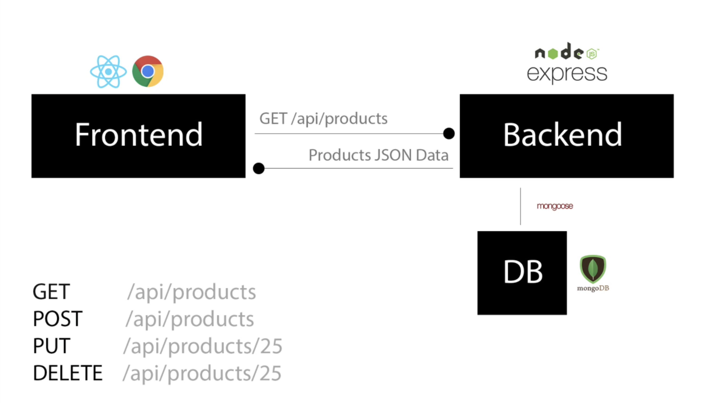

# Online shopping platform

> Building eCommerce website from scratch.

Preview of the website: [Link](https://hishopapp42.herokuapp.com/)

## Structure of the project

Using MEARN stack for managing front-end, back-end and database.



## Usage

We use ECMAScript Modules in the back-end for this project. Be sure to have at least Node v15.0+.  
When import a new file (not a module) in the backend, be sure to include **.js** at the end.

**Example:**

```js
import abc from "./dir/somefile.js";
```

### Env Variables

Creating a .env file in the root and add the following feature:

```
# Define the enviroment
NODE_ENV = development

# Define the port for running server
PORT = 5000

# Define URL of your mongodb
MONGO_URI = your mongodb uri

# Salt for jwt hashing
JWT_SECRET = your choice

# Integrate paypal
PAYPAL_CLIENT_ID = your papal client id
```

If you want to see the production build. You can set **NODE_ENV** to **production**

### Install Dependencies (front-end & back-end)

```
# Install necessary package for the whole app (make sure to do this step at the root directory)
npm install

# Install  necessary package for the frontend side (make sure to do this step in /frontend dir)
cd frontend
npm install
```

### Run

```
# Run both front-end (at port 3000) & backend (at port 5000) at the same time
# Run at the root dir
npm run dev

# Run the server only
npm run server
```

### Build

```
# Create frontend production build (make sure to go to /frontend)
cd frontend
npm run build
```

### Seed dummy data for usage

If you add new data to /data folder and run the script, all your current data will be over-written.

```
# Import data
npm run data:import

# Destroy data
npm run data:destroy
```

```
# Sample account for testing

# Admin account
ahihi@test.com
123456

# User account
ahihi2@test.com
123456

ahihi3@test.com
123456
```
